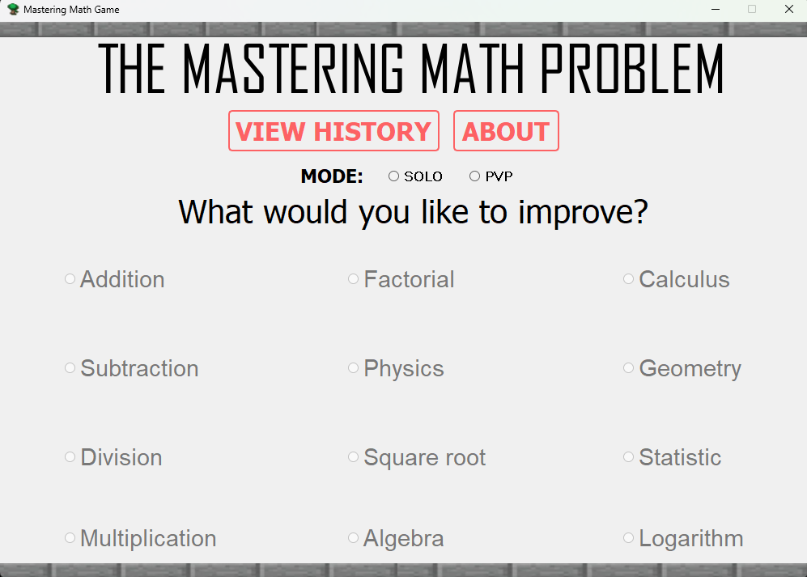
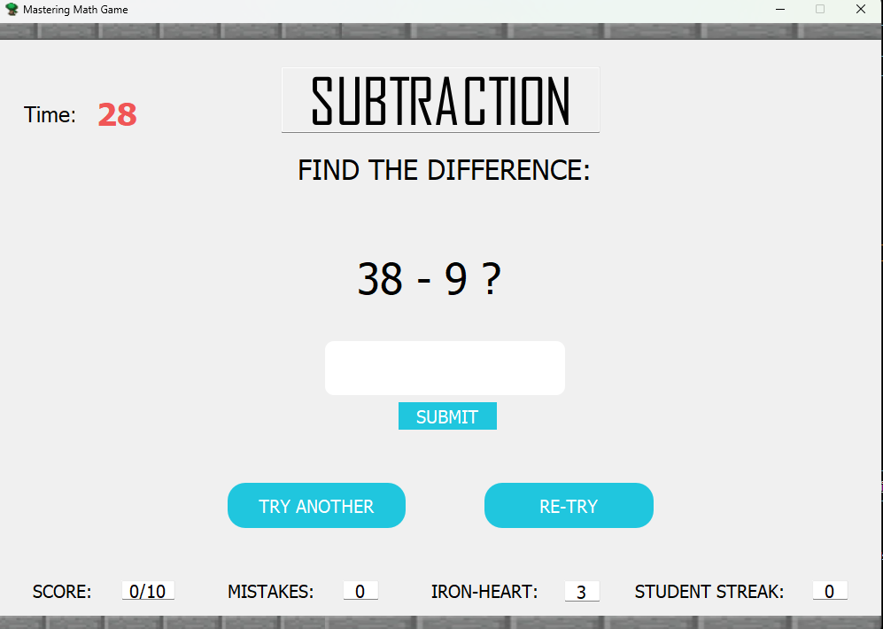
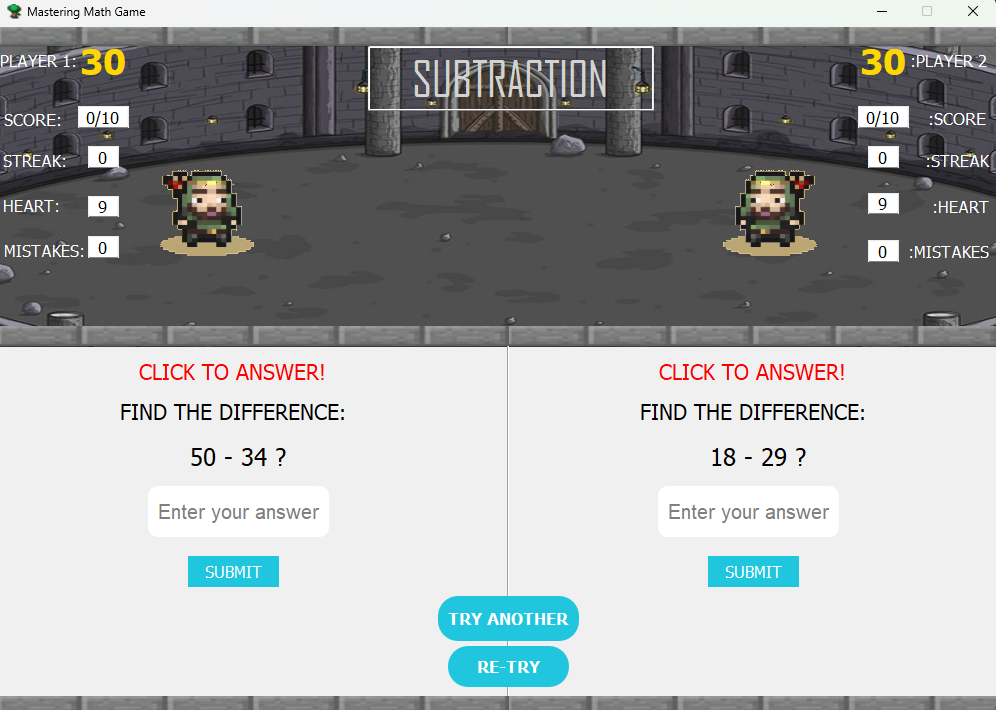

This project demonstrate the usage of OOP and SOLID principle:

4 pillars
- Encapsulation
- Abstraction
- Inheritance
- Polymorphism

5 Design principles:
- Single Responsibility Principle
- Open and Close Principle
- Liskov Subsitution Principle
- Interface Segregated Principle
- Depency Inversion Principle

